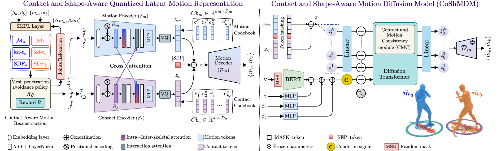

# CoShMDM: Contact and Shape-Aware Latent Motion Diffusion Model for Human Interaction Generation
[Ali Asghar Manjotho](https://github.com/AliManjotho), Tekie Tsegay Tewolde, Ramadhani Ally Duma, Zhendong Niu.

The official PyTorch implementation of the paper [**"CoShMDM: Contact and Shape Aware Latent Motion Diffusion Model for Human Interaction Generation"**](https://alimanjotho.github.io/coshmdm/).

Please visit our [**webpage**](https://alimanjotho.github.io/coshmdm/) for more details.





## Getting started

This code was tested on `Windows11 24H2` and requires:

* Python 3.8.0
* PyTorch 1.13.1+cu117
* conda3 or miniconda3

### 1. Setup FFMPEG
* Download ffmpeg from https://www.ffmpeg.org/download.html#build-windows
* Extract it in `C:\ffmpeg`.
* Add `C:\ffmpeg\bin` in `PATH` environment variable.


### 2. Setup miniconda environment
```shell
conda create -n coshmdm python==3.8.0
conda activate coshmdm
python -m spacy download en_core_web_sm
pip install -r requirements.txt
```

* Download dependencies:

```bash
bash protos/smpl_files.sh
bash protos/glove.sh
bash protos/t2m_evaluators.sh
```


### 3. Get datasets

Download the data from [webpage](https://tr3e.github.io/intergen-page/). And put them into ./data/.

#### Data Structure
```sh
<DATA-DIR>
./annots                //Natural language annotations where each file consisting of three sentences.
./motions               //Raw motion data standardized as SMPL which is similiar to AMASS.
./motions_processed     //Processed motion data with joint positions and rotations (6D representation) of SMPL 22 joints kinematic structure.
./split                 //Train-val-test split.
```


### 4. Get the pretrained models

* Download the pretrained models and place then unzip and place them in `./checkpoints/`. 

* **InterHuman** ([coshmdm.ckpt](https://drive.google.com/file/d/1JrVp4zO-gOYJAadhF1i_JemJje7Wzuw6/view?usp=sharing))
* **BERT** ([bert.ckpt](https://drive.google.com/file/d/1SHCRcE0es31vkJMLGf9dyLe7YsWj7pNL/view?usp=sharing))

Put coshmdm.ckpt under .\checkpoints\
Put bert.ckpt under .\eval_model\


## Demo

### 1. Download checkpoints and evaluation models
Run the shell script:

```shell
./prepare/download_pretrain_model.sh
./prepare/download_evaluation_model.sh
```
This will download coshmdm.ckpt under .\checkpoints\ and bert.ckpt under .\eval_model\.

### 2. Modify the configs
Modify config files ./configs/model.yaml and ./configs/infer.yaml


### 3. Modify the input file ./prompts.txt like:

```sh
In an intense boxing match, one is continuously punching while the other is defending and counterattacking.
With fiery passion two dancers entwine in Latin dance sublime.
Two fencers engage in a thrilling duel, their sabres clashing and sparking as they strive for victory.
The two are blaming each other and having an intense argument.
Two good friends jump in the same rhythm to celebrate.
Two people bow to each other.
Two people embrace each other.
...
```

### 4. Run
```shell
python tools/infer.py
```
The results will be rendered and put in ./results/


## Train

Modify config files ./configs/model.yaml ./configs/datasets.yaml and ./configs/train.yaml, and then run:

```shell
python tools/train.py
```


## Evaluation

### 1. Modify the configs
Modify config files ./configs/model.yaml and ./configs/datasets.yaml

### 2. Run
```shell
python tools/eval.py
```


## Application
<p float="left">
  
</p>


## Citation

If you find our work useful in your research, please consider citing:

```
@article{manjotho2025coshmdm,
  title={CoShMDM: Contact and Shape-Aware Latent Motion Diffusion Model for Human Interaction Generation},
  author={Ali Asghar Manjotho, Tekie Tsegay Tewolde, Ramadhani Ally Duma, Zhendong Niu},
  journal={IEEE Transactions on Visualization and Computer Graphics},
  year={2025},
  publisher={IEEE}
}
```


## Licenses
<a rel="license" href="http://creativecommons.org/licenses/by-nc-sa/4.0/"></a><br />This work is licensed under a <a rel="license" href="http://creativecommons.org/licenses/by-nc-sa/4.0/">Creative Commons Attribution-NonCommercial-ShareAlike 4.0 International License</a>.

All material is made available under [Creative Commons BY-NC-SA 4.0](https://creativecommons.org/licenses/by-nc-sa/4.0/legalcode) license. You can **use and adapt** the material for **non-commercial purposes**, as long as you give appropriate credit by **citing our paper** and **indicating any changes** that you've made.
